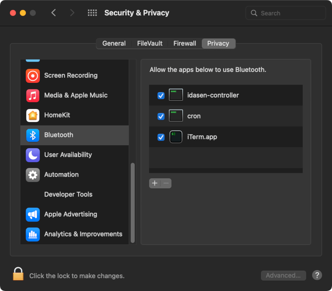

# Recipes

## Linux

### Albert Launcher

You can use the [albert](https://github.com/albertlauncher/albert) launcher along with two `.desktop` files to allow you to trigger this script from the launcher. An example of a desktop file for this is:

```
[Desktop Entry]
Name=Desk - Sit
Exec=/path/to/linak-controller --move-to sit
Icon=/home/user/linak-controller/sit-icon.png
Type=Application
Comment=Lower desk to sitting height.

```

(You can find the `linak-controller` path with `where linak-controller`)

### Scheduled standing periods

You can add some cron jobs to automatically raise and lower your desk. This way, the healthier habit is automatic.
The following cron raises the desk at 10 AM and 3 PM, and lowers it an hour later, Monday through Friday.

```
00 10 * * 1-5 python3 linak-controller --move-to stand
00 11 * * 1-5 python3 linak-controller --move-to sit
00 15 * * 1-5 python3 linak-controller --move-to stand
00 16 * * 1-5 python3 linak-controller --move-to sit
```

## macOS

### Scheduled new body positions

Get into different body positions regularly, the next position is the best!

1. Find out path of `linak-controller`

   ```
   which linak-controller
   ```

   For example installed with Homebrew `/opt/homebrew/bin/linak-controller`


2. Edit crontab

   ```
   crontab -e
   ```

3. Insert schedules to move desk to stand and sit position. Replace `<path>` from 1. step

   ```
   00 6-18/2 * * 1-5 <path>/linak-controller --move-to stand >/dev/null 2>&1
   25 6-18/2 * * 1-5 <path>/linak-controller --move-to sit >/dev/null 2>&1
   50 6-18/2 * * 1-5 <path>/linak-controller --move-to stand >/dev/null 2>&1
   10 7-18/2 * * 1-5 <path>/linak-controller --move-to sit >/dev/null 2>&1
   30 7-18/2 * * 1-5 <path>/linak-controller --move-to stand >/dev/null 2>&1
   45 7-18/2 * * 1-5 <path>/linak-controller --move-to sit >/dev/null 2>&1 
   ```

   This cronjob runs between 6am and 6pm, for example:

   ..., 8:00↑, 8:25↓, 8:50↑, 9:10↓, 9:30↑, 9:45↓, 10:00↑, 10:25↓, ...

   Note: Long-lasting constant body positions should be avoided. This applies to sitting and(!) standing.

4. Add `linak-controller` and `cron` in macOS *System Preferences* → *Security* → *Bluetooth*

   Without this important step `linak-controller` will not move the desk because Bluetooth permissions are missing.

   

5. See installed cron jobs

   ```
   crontab -l
   ```

Successfully tested with macOS 12.5, iTerm2 3.4.16, 

## Windows

### Autohotkey

A AutoHotkey script from @aienabled to drive the desk to stand and sit mode by pressing Ctrl+Alt+Shift+Up or Down arrow respectively:

```
;Idasen Desk - Stand
^!+Up::Run "C:\Users\...\Desk - Stand.lnk"

;Idasen Desk - Sit
^!+Down::Run "C:\Users\...\Desk - Sit.lnk"
```

These are shortcut files on the desktop but it's not necessary and could be simple python calls.

## Docker

You can run the script from within a docker file like this example:

```
FROM ubuntu

RUN apt update -y && apt upgrade -y

RUN apt install python3 python3-pip -y

ENV TZ=Europe/London

RUN ln -snf /usr/share/zoneinfo/$CONTAINER_TIMEZONE /etc/localtime && echo $CONTAINER_TIMEZONE > /etc/timezone

RUN apt install bluez -y

RUN apt install build-essential libglib2.0-dev libical-dev libreadline-dev libudev-dev libdbus-1-dev libdbus-glib-1-dev bluetooth libbluetooth-dev usbutils -y

RUN pip3 install linak-controller

COPY config.yaml .

ENTRYPOINT ["linak-contoller", "--config", "config.yaml"]
```

Build the image:

```
docker build -t linak-controller .
```

And then run it with the usual commands:

```
docker run -it --rm --privileged \
    --cap-add=SYS_ADMIN \
    --cap-add=NET_ADMIN \
    --net=host \
    -v /dev/bus/usb:/dev/bus/usb \
    -v /var/run/dbus:/var/run/dbus \
    linak-controller --watch
```

From @maxime1992
